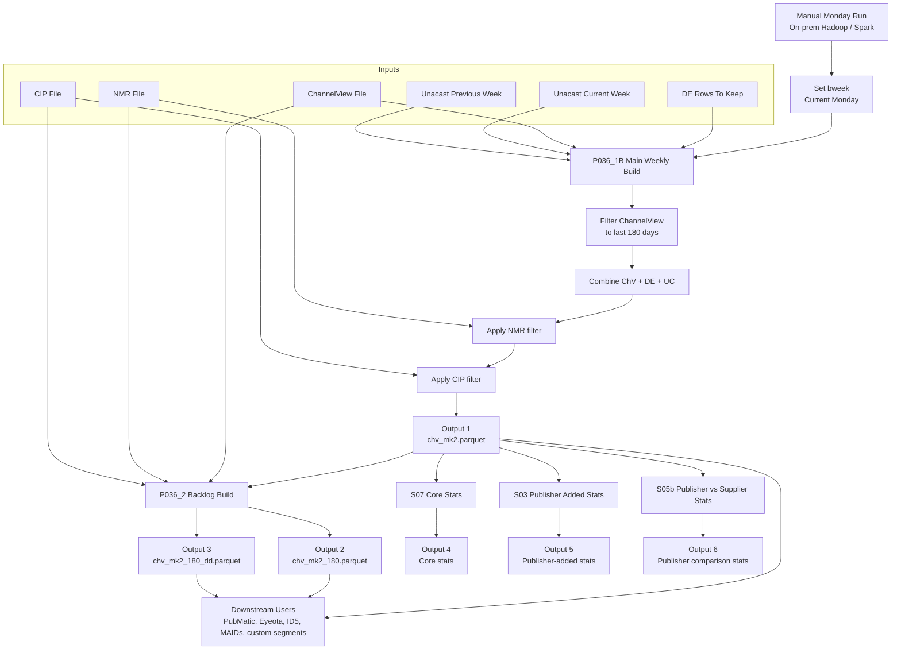
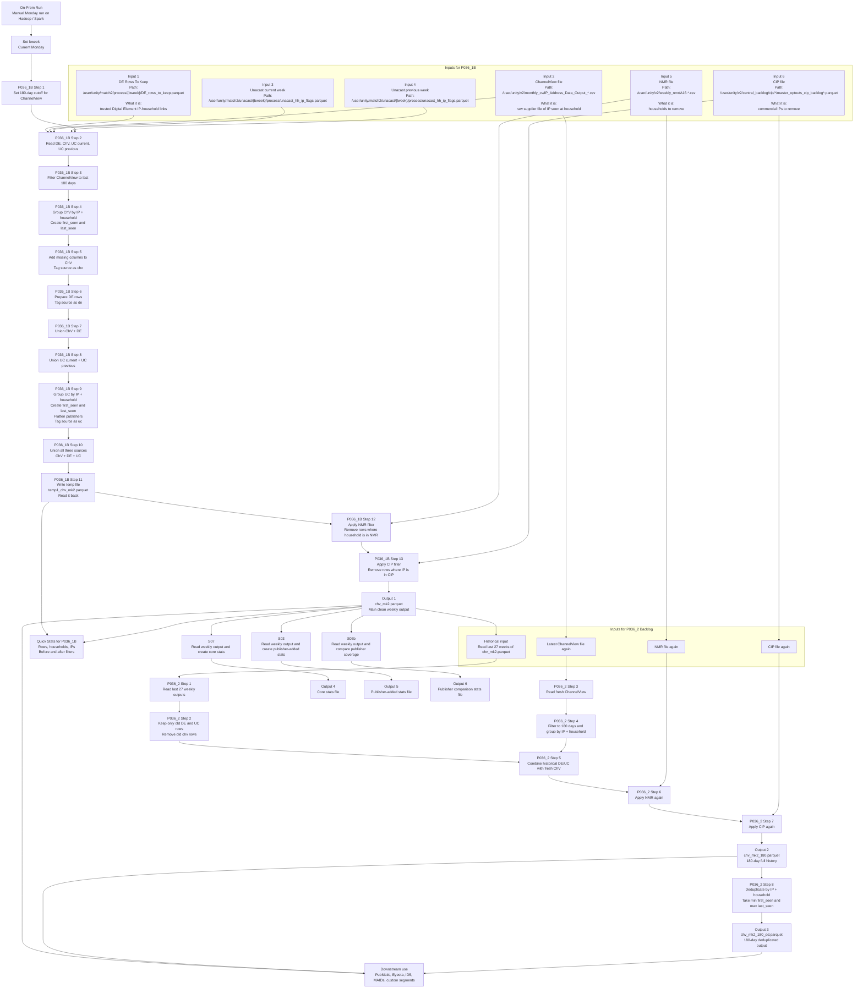

# ChV MK2 Director Demo

## Purpose

This document is a simple, demo-friendly explanation of the on-prem ChV MK2 process:

- what goes in
- what each process does
- what comes out
- what downstream users receive

Use this when explaining the flow to leadership, architecture, delivery, or operations teams.

---

## One-Sentence Summary

ChV MK2 is the on-prem weekly process that builds a trusted IP-to-household dataset by combining ChannelView, Digital Element, and Unacast, then removing bad households and bad IPs before publishing the final outputs.

---

## Read-Aloud Script

This section is written so you can read it directly in a demo.

### What ChV MK2 Is

ChV MK2 is the weekly process that helps us answer one business question:

`Which IP address belongs to which household?`

We need that answer because many downstream products and partners do not use raw supplier files directly. They need one clean, trusted output that has already been checked, combined, and cleaned.

So this process takes several different input files, gives them one common structure, removes records we do not trust, and publishes final output files that other teams and products can use.

---

### Why There Are Multiple Inputs

There is not one perfect source for IP-to-household links, so the process combines three different sources:

- `ChannelView`: raw supplier observations of IP seen at a household.
- `Digital Element`: trusted IP-household links that already passed an earlier quality process.
- `Unacast`: mobility-based IP-household links that improve coverage.

We also use two suppression files:

- `NMR`: households that should be removed because they are mobile-network related, not real home households.
- `CIP`: IPs that should be removed because they are commercial or business IPs, not home IPs.

So the process is really doing two jobs:

1. `Add good data from multiple sources.`
2. `Remove bad data using suppression rules.`

---

### What Starts The Process

The process is started manually every Monday morning on the on-prem Hadoop cluster.

The key date used across the whole flow is called `bweek`.

`bweek` means:

`the Monday of the business week for this run`

This matters because the input and output folders are organized by that week date. So once `bweek` is set, the process knows where to read from and where to write to.

---

## Inputs Explained Clearly

### Input 1: DE Rows To Keep

File:

`/user/unity/match2/process/{bweek}/DE_rows_to_keep.parquet`

What this file gives us:

- trusted Digital Element IP-household records
- records that already passed earlier checks
- extra quality flags that later stats processes use

Important columns:

- `ip`: the IP address
- `cb_key_household`: the household ID
- `first_seen`: first date this IP-household link was seen
- `last_seen`: latest date this IP-household link was seen
- `ip_rank`: quality ranking for the IP
- `ip_flag`: status flag for the IP
- `flag_chv`: whether this IP was also seen in ChannelView
- `flag_pubip`: whether publisher matching helped create the record
- `flag_audip`: whether Audigent-related logic touched the record
- `publishers`: publisher IDs linked to the record

Why we need it:

This is already a trusted source. It gives the process high-confidence IP-household links and useful metadata that ChannelView does not have by itself.

What we get from it:

- rows we can load almost directly into the final combined dataset
- business flags needed later for `S03` and `S05b`

---

### Input 2: ChannelView File

File:

`/user/unity/v2/monthly_cv/IP_Address_Data_Output_*.csv`

What this file gives us:

- raw supplier observations
- one row each time an IP was observed at a household

Important columns:

- `ip_address`: the IP address
- `cb_key_household`: the household ID
- `ip_date_of_capture`: the date of the observation

Why we need it:

This is the raw observation source. It gives broad coverage, but it is noisy and can contain repeat observations for the same IP-household pair.

What we do with it:

- keep only records from the last `180 days`
- group by `ip_address + cb_key_household`
- calculate:
  - `first_seen = minimum ip_date_of_capture`
  - `last_seen = maximum ip_date_of_capture`

Why we do that:

Because the same IP and household can appear many times in the raw file. The final process does not need every single daily record. It only needs to know:

- when did this link first appear
- when was it last seen

So this input is turned from a raw event-style file into a summarized household-IP link file.

---

### Input 3: Unacast Current Week

File:

`/user/unity/match2/unacast/{bweek}/process/unacast_hh_ip_flags.parquet`

What this file gives us:

- current-week Unacast household-IP links
- flags and publisher-related metadata

Important columns:

- `ip`
- `cb_key_household`
- `flag_chv`
- `flag_pubip`
- `flag_audip`
- `first`
- `last`
- `publishers`

Why we need it:

It adds more household-IP coverage than we would get from ChannelView and Digital Element alone.

What we do with it:

- later combine it with last week’s Unacast file
- group by `ip + cb_key_household`
- turn `first` into `first_seen`
- turn `last` into `last_seen`

---

### Input 4: Unacast Previous Week

File:

`/user/unity/match2/unacast/{lweek}/process/unacast_hh_ip_flags.parquet`

Why we also read last week:

Some good records appear in one weekly Unacast file but not the other. Reading both current and previous week gives stronger coverage and reduces the chance of losing useful matches.

What we do with it:

- union it with current-week Unacast
- aggregate at the same `ip + cb_key_household` level

What we get after combining both weeks:

- one cleaner Unacast view of each IP-household pair
- better stability in weekly output

---

### Input 5: NMR File

File:

`/user/unity/v2/weekly_nmr/A16.*.csv`

What this file gives us:

- a list of households to remove

Important column:

- `cb_key_household`

Why we need it:

Some households in source data are not real residential household signals. They may be linked to mobile-network behavior, where the link between IP and household is not reliable enough for this use case.

What we do with it:

- take distinct `cb_key_household`
- remove any record from our combined dataset where the household appears in this suppression list

How it is applied:

- left-anti join on `cb_key_household`

What we get:

- the dataset keeps only rows whose household does not appear in NMR

---

### Input 6: CIP File

File:

`/user/unity/v2/central_backlog/cip/*/master_optouts_cip_backlog*.parquet`

What this file gives us:

- a list of commercial IPs to remove

Important column:

- `host`

What the process does first:

- rename `host` to `ip`

Why we need it:

Some IPs belong to offices, universities, data centers, or other business locations. Those are not suitable for a household mapping product.

How it is applied:

- take distinct `ip`
- remove any row from the combined dataset where the IP appears in the CIP file

What we get:

- the dataset keeps only rows whose IP is not commercial

---

## Main Process: P036_1B Explained Step By Step

### Step 1: Set The ChannelView Freshness Rule

The script first calculates a cutoff date:

`today - 180 days`

Why this step exists:

ChannelView is a raw observation file. Old observations become stale. If we keep very old records, the output becomes less trustworthy.

So this step creates the rule:

`only use ChannelView records from the last 180 days`

Output of this step:

- one date value used later to filter ChannelView

---

### Step 2: Read All Main Input Files

The script reads:

- `DE_rows_to_keep.parquet`
- latest `ChannelView` file
- `Unacast current week`
- `Unacast previous week`

Why this step exists:

Before we can combine anything, all source datasets must be loaded into Spark.

What we get:

- one Spark DataFrame for DE
- one Spark DataFrame for ChannelView
- one Spark DataFrame for current Unacast
- one Spark DataFrame for previous Unacast

---

### Step 3: Process ChannelView

This is one of the most important steps.

What happens:

1. Filter ChannelView where `ip_date_of_capture >= cutoff`
2. Group by:
   - `ip_address`
   - `cb_key_household`
3. Calculate:
   - `first_seen = min(ip_date_of_capture)`
   - `last_seen = max(ip_date_of_capture)`
4. Rename `ip_address` to `ip`

Why this step exists:

The raw ChannelView file can contain many repeated rows for the same IP-household pair. We do not want all repeated events in the final weekly file. We want a clean record that tells us the first and latest date we saw that household-IP link.

So this step changes ChannelView from:

- raw observations

into:

- summarized IP-household links

What we get:

- one summarized ChannelView dataset at `ip + household` level

---

### Step 4: Make ChannelView Look Like DE

After ChannelView is summarized, its structure still does not match DE.

So the script adds missing columns to ChannelView:

- `ip_rank = null`
- `ip_flag = null`
- `flag_chv = null`
- `flag_pubip = null`
- `flag_audip = null`
- `publishers = [null]`

It also adds:

- `chv_de_flag = 'chv'`

Why this step exists:

Spark union works cleanly when the datasets share the same column structure. Also, the final output must remember where each row came from.

What we get:

- ChannelView rows in the same shape as DE rows
- clear source tag showing the row came from ChannelView

---

### Step 5: Prepare DE Rows

The script selects the business columns from DE and adds:

- `chv_de_flag = 'de'`

Why this step exists:

We want DE rows to look like the same final business structure as ChannelView rows.

What we get:

- DE rows ready to combine with ChannelView
- clear source tag showing the row came from DE

---

### Step 6: Combine ChannelView And DE

The script unions:

- prepared ChannelView rows
- prepared DE rows

Why this step exists:

At this point we have two sources in one common format, so we can create one shared dataset.

What we get:

- one combined dataset containing `chv` rows and `de` rows together

---

### Step 7: Combine Unacast Current And Previous Week

The script unions:

- current-week Unacast
- previous-week Unacast

Then it groups by:

- `ip`
- `cb_key_household`

And calculates:

- `max(flag_chv)`
- `max(flag_pubip)`
- `max(flag_audip)`
- `min(first)`
- `max(last)`
- `collect_set(publishers)`

Why this step exists:

Unacast can also have repeated or overlapping rows. We want one cleaner row per IP-household pair.

Why those columns are used:

- `ip` and `cb_key_household` define the identity of the match
- `min(first)` gives the earliest time the match was seen
- `max(last)` gives the latest time the match was seen
- `max(flag_...)` keeps the strongest flag value
- `collect_set(publishers)` keeps unique publisher information

What we get:

- one cleaner Unacast dataset at `ip + household` level

---

### Step 8: Make Unacast Look Like The Final Schema

The script then:

- renames `first` to `first_seen`
- renames `last` to `last_seen`
- adds any missing columns
- flattens and deduplicates publisher arrays
- adds `chv_de_flag = 'uc'`

Why this step exists:

Now Unacast can be safely combined with the ChannelView and DE dataset.

What we get:

- Unacast rows that match the same business shape as the other sources
- clear source tag showing the row came from Unacast

---

### Step 9: Combine All Three Sources

The script now unions:

- ChannelView rows
- Digital Element rows
- Unacast rows

Why this step exists:

This is the first point where we have the full weekly picture in one dataset.

What we get:

- one combined pre-filter dataset
- all trusted and candidate household-IP links in one place

This is still not final output because bad households and bad IPs still need to be removed.

---

### Step 10: Write Temp File And Read It Back

The script writes:

- `temp1_chv_mk2.parquet`

Then reads it back into Spark.

Why this step exists:

This helps materialize the combined dataset and makes the later filter steps more stable and easier to process.

What we get:

- one refreshed version of the combined pre-filter data

---

### Step 11: Apply NMR Filter

The script reads the NMR file and takes distinct:

- `cb_key_household`

Then it removes rows from the combined dataset where the household matches the NMR list.

Why this step exists:

We do not want household-IP links that are tied to mobile-network style households because they are not reliable residential matches.

What we get:

- the combined dataset after bad households are removed

---

### Step 12: Apply CIP Filter

The script reads the CIP file, renames:

- `host` to `ip`

Then it removes rows where the IP appears in the CIP file.

Why this step exists:

We do not want business or commercial IPs in a household product.

What we get:

- the clean final weekly dataset

---

### Step 13: Write Weekly Output

The script writes:

`/user/unity/match2/process/{bweek}/chv_mk2.parquet`

Why this step exists:

This is the main weekly product of ChV MK2. Other processes depend on this file.

What this output contains:

- clean IP-household rows
- source label showing whether each row came from `chv`, `de`, or `uc`
- first and latest seen dates
- business flags used later by statistics and publisher reporting

Why this file matters:

This is the main file used by downstream delivery and activation processes.

---

### Step 14: Create Quick Stats For P036_1B

The script also compares this week’s counts against the previous week.

It calculates values like:

- number of rows before filters
- number of households before filters
- number of IPs before filters
- number of rows after filters
- number of households after filters
- number of IPs after filters
- source-level household counts
- source-level IP counts

Why this step exists:

This is a health check. It helps the team spot unusual jumps or drops from one week to the next.

What we get:

- one stats output used for monitoring and reporting

---

## Backlog Process: P036_2 Explained Clearly

### Why P036_2 Exists

`chv_mk2.parquet` is the clean weekly file, but some use cases need a longer history.

So `P036_2` builds a rolling 180-day view.

It creates:

- a full 180-day file
- a deduplicated 180-day file

---

### Step 1: Read 27 Weekly Outputs

The script reads the last 27 weeks of:

- `chv_mk2.parquet`

Why this step exists:

It needs historical weekly output in order to build a rolling history.

What we get:

- historical weekly rows across roughly six months

---

### Step 2: Remove Old ChannelView Rows

The script keeps only historical rows where:

- `chv_de_flag != 'chv'`

Why this step exists:

Old ChannelView rows become stale faster. The process wants to rebuild the ChannelView part fresh from the latest raw ChannelView file instead of trusting old weekly `chv` rows.

What we get:

- historical `de` and `uc` rows kept
- historical `chv` rows removed

---

### Step 3: Rebuild Fresh ChannelView For 180 Days

The script reads the latest ChannelView file again and does the same basic logic:

- filter to last 180 days
- group by `ip + cb_key_household`
- calculate `first_seen` and `last_seen`
- tag rows as `chv`

Why this step exists:

This gives one fresh consistent ChannelView view across the whole 180-day window.

What we get:

- current 180-day ChannelView dataset

---

### Step 4: Combine Historical DE/UC With Fresh ChannelView

The script unions:

- historical DE and UC rows
- fresh 180-day ChannelView rows

Why this step exists:

This creates the full rolling history dataset.

What we get:

- one 180-day combined history before suppression filters

---

### Step 5: Apply NMR And CIP Again

The backlog process applies:

- NMR again
- CIP again

Why this step exists:

The same quality rules must be applied to the historical backlog, not only to the weekly file.

What we get:

- clean 180-day history

---

### Step 6: Write The Full 180-Day Output

The script writes:

`/user/unity/match2/process/{bweek}/chv_mk2_180.parquet`

What this file is:

- the full 180-day history
- may contain more than one row for the same IP-household pair

Why:

Because the same pair may appear across multiple weeks and sources over time.

---

### Step 7: Deduplicate The 180-Day Output

The script groups by:

- `ip`
- `cb_key_household`

Then calculates:

- `first_seen = min(first_seen)`
- `last_seen = max(last_seen)`

Why this step exists:

Some downstream users want only one row per IP-household pair, not a time history with repeats.

What we get:

- one simplified view of the 180-day history

---

### Step 8: Write The Deduplicated 180-Day Output

The script writes:

`/user/unity/match2/process/{bweek}/chv_mk2_180_dd.parquet`

What this file is:

- the simplified 180-day output
- one row per IP-household pair

Why this file matters:

It is easier for downstream consumers that only need the best overall 180-day relationship, not the week-by-week history.

---

## Stats Processes Explained Clearly

### S07: Core ChV MK2 Stats

What it reads:

- weekly `chv_mk2.parquet`
- taxonomy suppress file
- monthly ChannelView file

Why it exists:

To show whether the weekly output looks healthy and whether coverage changed.

What it produces:

- counts for rows, IPs, households
- freshness metrics
- coverage metrics
- “what did ChV add” style checks

What this helps answer:

- did this week look normal
- did we lose too many households
- did one source shrink unexpectedly

---

### S03: Publisher-Added Stats

What it reads:

- weekly `chv_mk2.parquet`

What rows it focuses on:

- `flag_chv = '0'`
- `flag_pubip = '1'`

Why those columns matter:

They identify rows that were not directly from ChannelView but were added through publisher matching logic.

What it does:

- explode `publishers`
- count IPs and households by publisher
- find exclusive publisher contribution

What it produces:

- publisher-added stats files

What this helps answer:

- which publishers added the most useful records
- which records came only from one publisher

---

### S05b: Publisher Vs Supplier Comparison

What it reads:

- weekly `chv_mk2.parquet`
- publisher parquet files

Why it exists:

To compare publisher coverage against the supplier-driven household-IP coverage.

What it produces:

- comparison stats for `de`
- comparison stats for `uc`
- comparison stats for `all`

What this helps answer:

- how much overlap there is between publisher IPs and supplier coverage
- where supplier coverage is stronger or weaker

---

## Final Outputs Summary

### Output 1: `chv_mk2.parquet`

Created by:

- `P036_1B`

What it is:

- the main clean weekly production file

Why it is important:

- this is the core weekly deliverable
- other processes read this file
- downstream business users rely on this file

---

### Output 2: `chv_mk2_180.parquet`

Created by:

- `P036_2`

What it is:

- the full 180-day history file

Why it is important:

- keeps the richer longer history
- useful when the downstream process wants to preserve time-based presence

---

### Output 3: `chv_mk2_180_dd.parquet`

Created by:

- `P036_2`

What it is:

- the deduplicated 180-day history file

Why it is important:

- simpler file
- one row per IP-household pair
- easier for downstream processes that do not need repeated history

---

### Output 4: Core Stats

Created by:

- `S07`

Why it is important:

- tells the team whether the weekly output looks healthy

---

### Output 5: Publisher-Added Stats

Created by:

- `S03`

Why it is important:

- shows what value publisher matching added

---

### Output 6: Publisher Comparison Stats

Created by:

- `S05b`

Why it is important:

- shows how publisher coverage compares with supplier coverage

---

## High-Level Diagram

Use this when you want a short executive view first.

---

## Detailed On-Prem Diagram

Use this when you want to explain exactly what goes in, what each step does, and what comes out.

---

## Very Simple Demo Script

Use this wording if you want to walk your director through the diagram in plain English:

1. `The process is started manually on the on-prem Hadoop cluster every Monday.`
2. `It sets the business week date called bweek.`
3. `The main script reads Digital Element, ChannelView, and two weeks of Unacast.`
4. `ChannelView is cut down to the last 180 days so only fresh records are kept.`
5. `The three sources are reshaped into one common format and joined together.`
6. `The combined data is cleaned by removing mobile-network households and commercial IPs.`
7. `That clean weekly file is written as chv_mk2.parquet.`
8. `A second script then builds a 180-day historical version from the weekly outputs.`
9. `That backlog script writes both a full history file and a deduplicated history file.`
10. `Other scripts then create health-check and publisher statistics from the weekly output.`

---

## Input Samples As Tables

### Sample DE Rows To Keep

| ip | cb_key_household | first_seen | last_seen | ip_rank | flag_chv | flag_pubip | flag_audip | publishers |
|---|---|---|---|---:|---:|---:|---:|---|
| 82.45.112.33 | HH001 | 2025-01-05 | 2025-05-10 | 1 | 1 | 0 | 0 | null |
| 94.197.88.201 | HH002 | 2025-03-12 | 2025-05-15 | 2 | 0 | 1 | 0 | [pub_001] |

### Sample ChannelView Raw Rows

| ip_address | cb_key_household | ip_date_of_capture |
|---|---|---|
| 82.45.112.33 | HH001 | 2025-04-22 |
| 82.45.112.33 | HH001 | 2025-05-10 |
| 77.102.31.14 | HH003 | 2025-05-01 |

### Sample Unacast Rows

| ip | cb_key_household | flag_chv | flag_pubip | first | last | publishers |
|---|---|---:|---:|---|---|---|
| 109.147.55.78 | HH004 | 1 | 0 | 2025-04-14 | 2025-05-12 | [] |
| 86.11.200.45 | HH005 | 0 | 1 | 2025-05-05 | 2025-05-17 | [pub_010] |

### Sample NMR Rows

| cb_key_household |
|---|
| HH9001 |
| HH9002 |

### Sample CIP Rows

| host |
|---|
| 195.206.44.89 |
| 212.58.224.100 |

---

## Output Samples

### Weekly Output `chv_mk2.parquet`

| ip | cb_key_household | first_seen | last_seen | ip_rank | flag_chv | flag_pubip | flag_audip | publishers | chv_de_flag |
|---|---|---|---|---:|---|---|---|---|---|
| 82.45.112.33 | HH001 | 2025-04-22 | 2025-05-10 | null | null | null | null | null | chv |
| 82.45.112.33 | HH001 | 2025-01-05 | 2025-05-10 | 1 | 1 | 0 | 0 | null | de |
| 109.147.55.78 | HH004 | 2025-04-14 | 2025-05-12 | null | null | 1 | 0 | null | uc |

### 180-Day Deduplicated Output `chv_mk2_180_dd.parquet`

| ip | cb_key_household | first_seen | last_seen |
|---|---|---|---|
| 82.45.112.33 | HH001 | 2025-01-05 | 2025-05-10 |
| 109.147.55.78 | HH004 | 2025-04-14 | 2025-05-12 |

---

## What Each Output Is For

- `chv_mk2.parquet`: created by `P036_1B`; this is the main clean weekly file; downstream jobs and downstream business users read this file.
- `chv_mk2_180.parquet`: created by `P036_2`; this is the full 180-day history file; it can contain more than one row for the same IP-household pair across time.
- `chv_mk2_180_dd.parquet`: created by `P036_2`; this is the deduplicated 180-day file; it keeps one row per IP-household pair with earliest `first_seen` and latest `last_seen`.
- `S07` stats output: created from `chv_mk2.parquet`; this is the core health-check file for volume, freshness, and coverage.
- `S03` stats output: created from `chv_mk2.parquet`; this shows what was added through publisher matching.
- `S05b` stats output: created from `chv_mk2.parquet` plus publisher files; this compares publisher coverage against supplier coverage.

---

## Demo Tips

- If the audience is non-technical, spend most time on the yellow and red boxes: combine sources, remove bad data, publish clean output.
- If the audience is technical, point out that NMR and CIP are both left-anti suppression joins.
- If the audience asks why there are two backlog outputs, explain that one preserves history and one simplifies it.
- If the audience asks why two Unacast weeks are read, explain that it helps keep more good household coverage.
