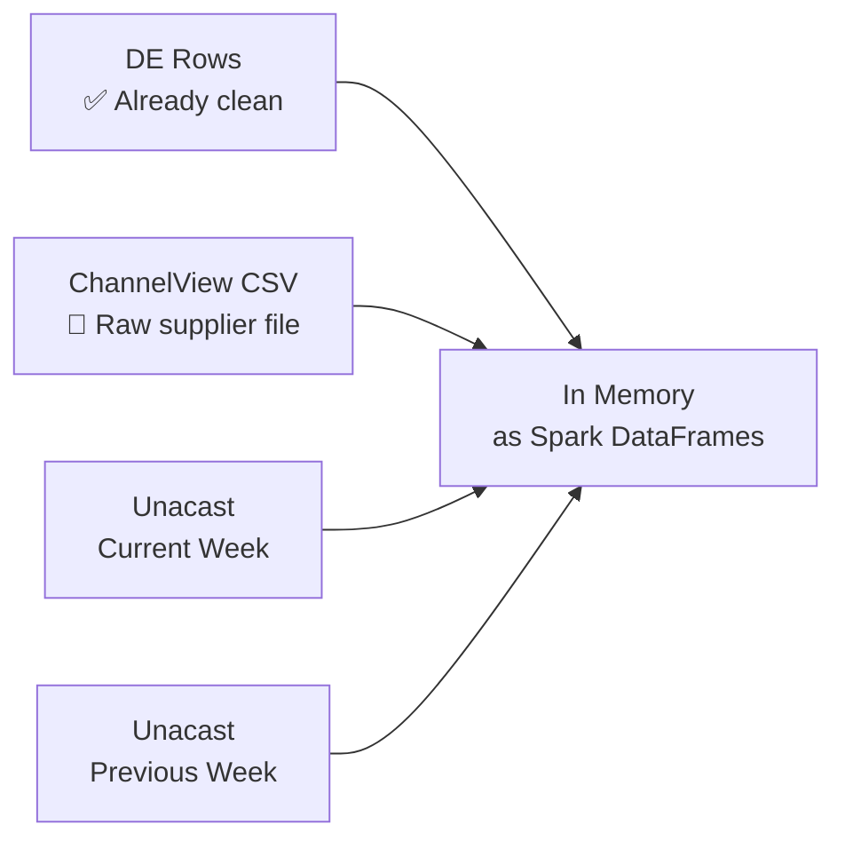
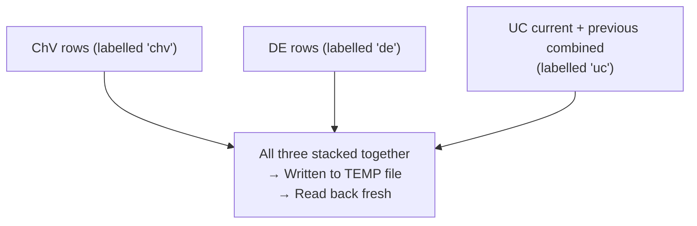
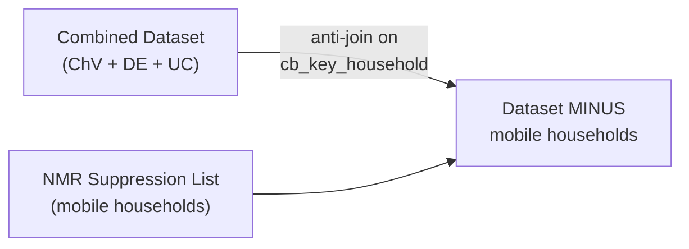
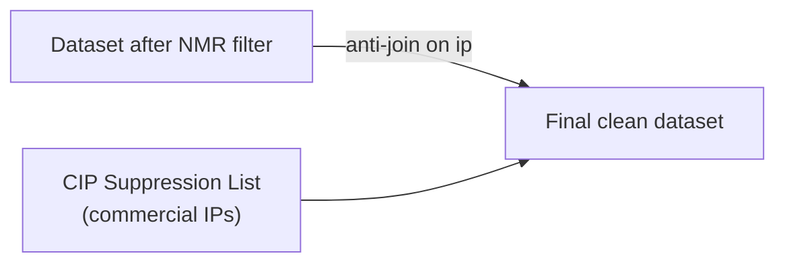
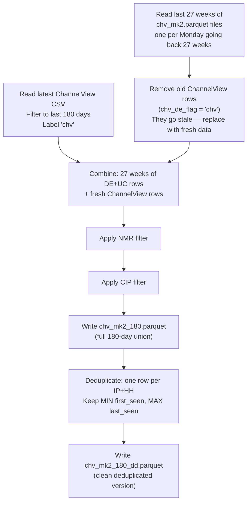
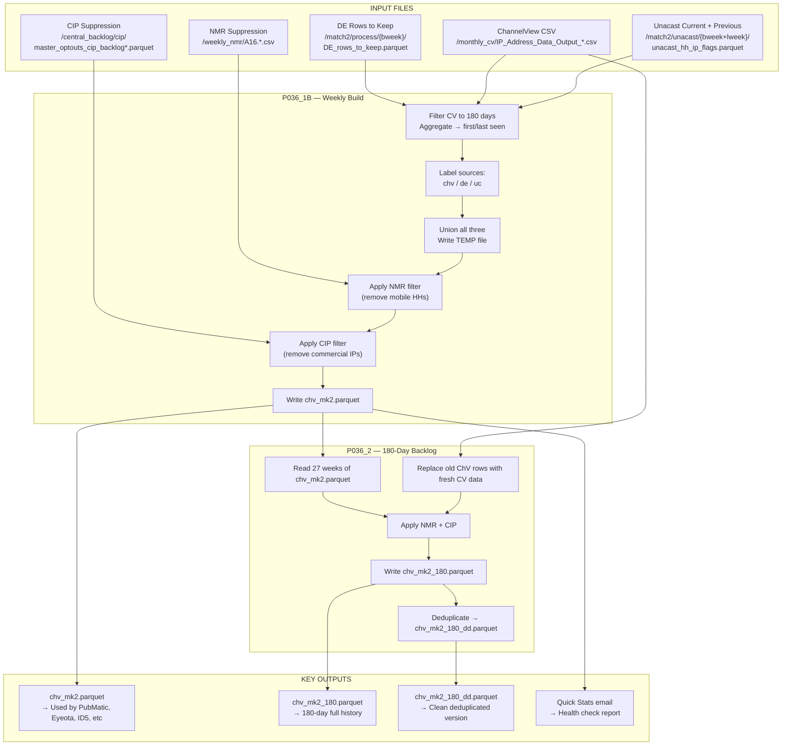

# ChV MK2 — What It Is, What It Does & How It Works
### *A plain-English, step-by-step guide*

---

## So… What Actually Is ChV MK2?

Think of it this way.

Experian wants to be able to say:
> *"This IP address belongs to this household."*

That's it. That single mapping — **IP → Household** — is what everything is built on.
Once you know that, you can say "show this ad to people in this household" or "this person browsed these sites" — because you tied the IP to a real UK household.

**ChV MK2** (Channel View Mark 2) is the process that builds and maintains that **IP-to-Household mapping table**, every single week.

It doesn't do it from one source — it pulls from **three different data suppliers**, cleans them, combines them, removes junk, and produces one trusted dataset.

---

## The Three Data Sources

| Source | Short Name | What It Is |
|---|---|---|
| **ChannelView** | ChV | A file from a data supplier showing which IP was seen at which household |
| **Digital Element** | DE | An IP intelligence provider — gives verified IP-to-household links |
| **Unacast** | UC | A mobility data provider — uses location signals to link IPs to households |

Each source is labelled in the final output with a column called **`chv_de_flag`** — so you always know where each row came from.

---

## When Does This Run?

> **Every Monday morning** — the script is kicked off manually on the on-prem Hadoop cluster.

The key date variable is called **`bweek`** — it's always the **Monday of the current week** (e.g. `2025-05-19`). All file paths are organised by this date.

---

## The Input Files (What Goes In)

---

### INPUT 1 — DE Rows to Keep
**"The Digital Element households we trust"**

This is produced earlier in the same pipeline (by P035_4). It's a cleaned version of the Digital Element data — only the IP-household pairs that passed quality checks.

📂 **Location:** `/user/unity/match2/process/{bweek}/DE_rows_to_keep.parquet`

| Column | What It Means |
|---|---|
| `ip` | The IP address |
| `cb_key_household` | Experian's household ID |
| `first_seen` | First date this IP was linked to this household |
| `last_seen` | Most recent date this IP was linked to this household |
| `ip_rank` | Quality score — lower = more trusted |
| `ip_flag` | Status flag for the IP |
| `flag_chv` | Was this IP also seen in ChannelView? (`1` = yes) |
| `flag_pubip` | Was this IP matched via a publisher? (`1` = yes) |
| `publishers` | Which publishers contributed this IP (list) |
| `flag_audip` | Was this IP seen in Audigent data? |

**Sample Data:**

| ip | cb_key_household | first_seen | last_seen | ip_rank | flag_chv | flag_pubip | chv_de_flag *(added later)* |
|---|---|---|---|---|---|---|---|
| 82.45.112.33 | A3F9B12C7E4D | 2025-01-05 | 2025-05-10 | 1 | 1 | 0 | de |
| 94.197.88.201 | B7D3E8A1C02F | 2025-03-12 | 2025-05-15 | 2 | 0 | 1 | de |
| 109.147.55.78 | C1A4F6D9B03E | 2024-12-01 | 2025-05-18 | 1 | 1 | 1 | de |

---

### INPUT 2 — ChannelView File
**"The monthly file from our ChannelView supplier"**

A large CSV file delivered monthly, showing which IP address was observed at which household across various websites.

📂 **Location:** `/user/unity/v2/monthly_cv/IP_Address_Data_Output_*.csv` *(latest file auto-selected)*

| Column | What It Means |
|---|---|
| `ip_address` | The IP address observed |
| `cb_key_household` | The household matched to this IP |
| `ip_date_of_capture` | The date this IP-household pairing was observed |

> ⚠️ **Important filter:** Only records where `ip_date_of_capture` is within the last **180 days** are used. Older observations are too stale to be reliable.

**Sample Data:**

| ip_address | cb_key_household | ip_date_of_capture |
|---|---|---|
| 82.45.112.33 | A3F9B12C7E4D | 2025-04-22 |
| 77.102.31.14 | D8B2C5F7A091 | 2025-05-01 |
| 82.45.112.33 | A3F9B12C7E4D | 2025-05-10 |
| 195.206.44.89 | E4A7D3B9C16F | 2025-03-08 |

> Notice the same IP can appear multiple times. They get **aggregated** — we just keep the earliest and latest date seen.

---

### INPUT 3 — Unacast (Current Week)
**"This week's mobility-based IP-to-household links"**

Unacast uses mobile location signals to infer which household a device (and thus an IP) belongs to.

📂 **Location:** `/user/unity/match2/unacast/{bweek}/process/unacast_hh_ip_flags.parquet`

### INPUT 4 — Unacast (Previous Week)
📂 **Location:** `/user/unity/match2/unacast/{lweek}/process/unacast_hh_ip_flags.parquet`

> Both current and previous week are loaded to maximise coverage — some households may only appear in one week.

| Column | What It Means |
|---|---|
| `ip` | IP address |
| `cb_key_household` | Household identifier |
| `flag_chv` | Also seen in ChannelView? |
| `flag_pubip` | Matched via a publisher IP? |
| `flag_audip` | Seen in Audigent? |
| `first` | First time seen *(renamed to `first_seen`)* |
| `last` | Last time seen *(renamed to `last_seen`)* |
| `publishers` | Nested list of publisher IDs |

**Sample Data:**

| ip | cb_key_household | flag_chv | flag_pubip | first | last |
|---|---|---|---|---|---|
| 109.147.55.78 | C1A4F6D9B03E | 1 | 0 | 2025-04-14 | 2025-05-12 |
| 86.11.200.45 | F2E8A3D7B140 | 0 | 1 | 2025-05-05 | 2025-05-17 |

---

### INPUT 5 — NMR File (Network Mobile Removal)
**"The list of households we must exclude — they're mobile networks, not homes"**

Some IP addresses belong to mobile carrier networks (like 3G/4G towers). One IP can represent thousands of different users, so linking it to "a household" is meaningless. The NMR file tells us which households to remove.

📂 **Location:** `/user/unity/v2/weekly_nmr/A16.*.csv` *(latest file auto-selected)*

| Column | What It Means |
|---|---|
| `cb_key_household` | The household to be excluded |

**Sample Data:**

| cb_key_household |
|---|
| G9C3E1B7A024 |
| H5F8D2B6A391 |

> Any row in our dataset whose `cb_key_household` matches one here gets **deleted**.

---

### INPUT 6 — CIP File (Commercial IP Opt-Out)
**"The list of IPs we must exclude — they belong to offices, not homes"**

Some IPs belong to business premises (office buildings, data centres, universities). We don't want these in a household dataset.

📂 **Location:** `/user/unity/v2/central_backlog/cip/*/master_optouts_cip_backlog*.parquet`

| Column | What It Means |
|---|---|
| `host` | The commercial IP to exclude *(renamed to `ip`)* |

**Sample Data:**

| host |
|---|
| 195.206.44.89 |
| 212.58.224.100 |

> Any row whose `ip` matches one here gets **deleted**.

---

## Step-by-Step: What P036_1B Does

> This is the **main weekly script**. Everything else depends on its output.

---

### Step 1 — Set the Date Cutoff

The very first thing it does is calculate: **"What date was 180 days ago?"**

For example, if today is `2025-05-19`, then the cutoff is `2024-11-20`.

**Why?** ChannelView data older than 180 days is considered too stale. We only want IP-household links that are reasonably fresh.

---

### Step 2 — Read All Four Input Files

It loads:
- DE rows to keep (the pre-cleaned Digital Element data)
- ChannelView CSV
- Unacast current week
- Unacast previous week

---

### Step 3 — Process ChannelView

**What happens:** Filter ChannelView to only the last 180 days, then collapse duplicates.

The same IP can appear in ChannelView dozens of times over multiple days. We don't need every row — we just need to know: *"When was the first time we saw this IP at this household, and when was the last time?"*

**Before** (raw ChannelView):
| ip_address | cb_key_household | ip_date_of_capture |
|---|---|---|
| 82.45.112.33 | A3F9B12C7E4D | 2025-04-22 |
| 82.45.112.33 | A3F9B12C7E4D | 2025-05-01 |
| 82.45.112.33 | A3F9B12C7E4D | 2025-05-10 |

**After** (aggregated):
| ip | cb_key_household | first_seen | last_seen |
|---|---|---|---|
| 82.45.112.33 | A3F9B12C7E4D | 2025-04-22 | 2025-05-10 |

Then we add placeholder columns (`ip_rank=null`, `ip_flag=null`, etc.) so the schema matches DE, and we label it: **`chv_de_flag = 'chv'`**

---

### Step 4 — Label & Combine ChannelView + DE

Both datasets now have the same columns. We label them and stack them on top of each other.

| ip | cb_key_household | first_seen | last_seen | chv_de_flag |
|---|---|---|---|---|
| 82.45.112.33 | A3F9B12C7E4D | 2025-04-22 | 2025-05-10 | **chv** |
| 77.102.31.14 | D8B2C5F7A091 | 2025-05-01 | 2025-05-01 | **chv** |
| 82.45.112.33 | A3F9B12C7E4D | 2025-01-05 | 2025-05-10 | **de** |
| 94.197.88.201 | B7D3E8A1C02F | 2025-03-12 | 2025-05-15 | **de** |

> Notice: the same IP (`82.45.112.33`) appears **twice** — once from ChannelView and once from DE. That's fine — both rows are kept. They tell different stories (different source, possibly different quality flags).

---

### Step 5 — Process & Add Unacast

Current + previous week Unacast data are combined, grouped by `ip + cb_key_household`, then labelled **`chv_de_flag = 'uc'`** and added to the dataset.

📂 **Temp file written to:** `/user/unity/match2/process/{bweek}/temp1_chv_mk2.parquet`

Why write and re-read? It forces Spark to **materialise** the data and flush its execution plan — makes subsequent steps faster and more stable.

---

### Step 6 — Apply NMR Filter

> *"Remove any household that is a mobile network."*

We take the NMR file, extract all the `cb_key_household` values in it, and do an **anti-join** — meaning: keep every row in our dataset that does **NOT** appear in the NMR list.

---

### Step 7 — Apply CIP Filter

> *"Remove any IP address that belongs to a commercial building."*

Same idea — anti-join on `ip`. Any IP in the CIP list gets removed along with all its rows.

---

### Step 8 — Write the Final Output

📂 **Output:** `/user/unity/match2/process/{bweek}/chv_mk2.parquet`

**What it looks like:**

| ip | cb_key_household | first_seen | last_seen | ip_rank | flag_chv | flag_pubip | flag_audip | publishers | chv_de_flag |
|---|---|---|---|---|---|---|---|---|---|
| 82.45.112.33 | A3F9B12C7E4D | 2025-04-22 | 2025-05-10 | null | null | null | null | null | chv |
| 82.45.112.33 | A3F9B12C7E4D | 2025-01-05 | 2025-05-10 | 1 | 1 | 0 | null | null | de |
| 109.147.55.78 | C1A4F6D9B03E | 2025-04-14 | 2025-05-12 | null | null | null | null | null | uc |
| 94.197.88.201 | B7D3E8A1C02F | 2025-03-12 | 2025-05-15 | 2 | 0 | 1 | null | [pub_001] | de |

**Why this file matters:** This is the **primary output** used by every downstream pipeline — PubMatic, Eyeota, ID5, MAIDs, custom segments — all of them read from `chv_mk2.parquet`.

---

## Step-by-Step: What P036_2 Does (The 180-Day Backlog)

> This script runs **after** P036_1B. It builds a longer-term rolling dataset.

**The problem it solves:** `chv_mk2.parquet` only reflects *this week's* data. But for some use cases (like PubMatic delivery), you need to know if a household was seen *at any point in the last 6 months*, not just this week.

### Two Output Files

**File 1:** `/user/unity/match2/process/{bweek}/chv_mk2_180.parquet`
Multiple rows possible per IP-household pair (one per week it appeared)

| ip | cb_key_household | first_seen | last_seen | chv_de_flag |
|---|---|---|---|---|
| 82.45.112.33 | A3F9B12C7E4D | 2025-01-05 | 2025-01-12 | de |
| 82.45.112.33 | A3F9B12C7E4D | 2025-02-03 | 2025-02-10 | de |
| 82.45.112.33 | A3F9B12C7E4D | 2025-04-22 | 2025-05-10 | chv |

**File 2:** `/user/unity/match2/process/{bweek}/chv_mk2_180_dd.parquet`
One row per IP-household pair — earliest first_seen, latest last_seen

| ip | cb_key_household | first_seen | last_seen |
|---|---|---|---|
| 82.45.112.33 | A3F9B12C7E4D | 2025-01-05 | 2025-05-10 |

---

## Quick Stats — Built-In Health Check

After each script runs, it **automatically compares this week's numbers to last week's** and flags any big changes.

For P036_1B it tracks 12 metrics:

| # | Metric | Example |
|---|---|---|
| 1 | Total rows before NMR & CIP | 45,230,100 |
| 2 | Distinct households before NMR & CIP | 12,400,000 |
| 3 | Distinct IPs before NMR & CIP | 18,700,000 |
| 4 | Total rows **after** filters | 43,100,000 |
| 5 | Distinct households **after** filters | 11,900,000 |
| 6 | Distinct IPs **after** filters | 17,500,000 |
| 7 | Households from ChannelView | 8,200,000 |
| 8 | Households from Digital Element | 6,100,000 |
| 9 | Households from Unacast | 3,900,000 |
| 10 | IPs from ChannelView | 12,100,000 |
| 11 | IPs from Digital Element | 9,400,000 |
| 12 | IPs from Unacast | 5,600,000 |

🟢 = went up vs last week | 🔴 = went down | ⚪ = no change

Results are emailed out automatically when the script finishes.

---

## The Full Picture in One Diagram

---

*Built from source: `match3_mvp1` repo — on-prem Hadoop/Spark pipeline*
